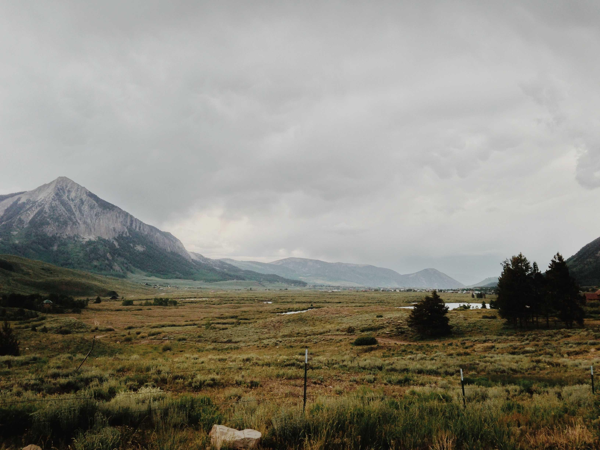
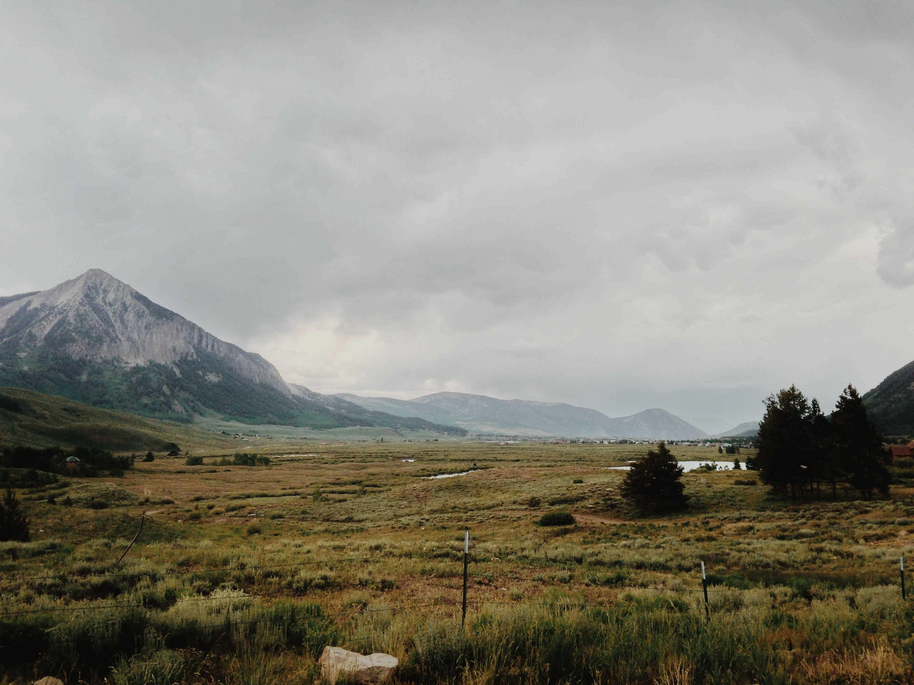

<p align="center">
  
</p>

<h1 align="center">Cipher Canvas</h1>

<p align="center">
  <strong>Stealthy, Secure, and Robust Image Steganography for Desktop</strong><br>
  Conceal confidential files and secret payloads inside ordinary images without visible distortion.
</p>

<p align="center">
  <a href="https://github.com/rigitty/cipher-canvas/releases"></a>
  <a href="LICENSE"></a>
  
  
  
  
  
  
  
</p>

---

## Overview

Cipher Canvas is a desktop application engineered for covert data protection. While conventional encryption tools produce scrambled, suspicious-looking files, Cipher Canvas embeds your encrypted content directly inside standard image files.

To any observer or automated scanner, the resulting image appears completely untouched. Only a recipient possessing Cipher Canvas and the designated secret passphrase can detect and extract the hidden data.

---

## Visual Demonstration

<table width="100%">
  <thead>
    <tr>
      <th width="50%" align="center">Raw Image</th>
      <th width="50%" align="center">Encoded Image - 4.33 MB Hidden Video</th>
    </tr>
  </thead>
  <tbody>
    <tr>
      <td align="center">
        
      </td>
      <td align="center">
        
      </td>
    </tr>
  </tbody>
</table>

---

## Core Capabilities

- **Authenticated Encryption**: Every payload is encrypted with AES-256-GCM before embedding. Passphrases are hardened with Argon2id to resist brute-force attacks.
- **Imperceptible Modification**: Pixel alterations are distributed pseudorandomly, preserving original visual fidelity and passing perceptual inspection.
- **Damage Recovery (FEC)**: Built-in Reed-Solomon Forward Error Correction allows successful data recovery even if carrier images experience minor corruption, noise, or compression artifacts.
- **Multi-Image Sharding**: Partition larger files across multiple carrier images automatically based on individual image capacities.
- **Lightweight Architecture**: Built with Tauri v2 and React for instant launch times, low memory overhead, and native Windows desktop integration.

---

## Workflow Guide

### 1. Hiding and Encrypting (Sender)
1. Launch Cipher Canvas and navigate to the **Encode** section.
2. Select or drop a carrier image (lossless PNG format is recommended).
3. Select the file or type the secret message to conceal.
4. Define a secure **passphrase**.
5. Click **Encode & Save**. The exported image retains the exact appearance of the original photograph.

### 2. Extracting and Decrypting (Recipient)
1. Deliver the saved image to the recipient through standard channels (e.g., email, cloud storage, external drives).
2. The recipient launches Cipher Canvas and selects **Decode**.
3. Import the carrier image and enter the **identical passphrase** used during encryption.
4. Click **Decode**. Cipher Canvas authenticates and reconstructs the original hidden file.

> **Security Note**: Without the correct passphrase, the hidden data cannot be decrypted or identified. To unauthorized parties, the file remains an ordinary image.

---

## Installation (Windows)

Pre-built binaries are available on the [**GitHub Releases**](https://github.com/rigitty/cipher-canvas/releases) page:

- **`.exe` Installer (Recommended)**: Standard setup wizard with automatic shortcut creation.
- **`.msi` Package**: Windows Installer package designed for enterprise and silent deployments.

> **Windows SmartScreen**: Because Cipher Canvas is an open-source project without a commercial code-signing certificate, Windows SmartScreen may present an "Unknown Publisher" dialog on initial launch. Click **More info -> Run anyway** to proceed.

---

## Source Installation and Development

To build or contribute to Cipher Canvas locally:

### Prerequisites
- Node.js (version 18 or later)
- Rust (stable toolchain)
- Python (version 3.10 or later)

### Setup Instructions
```bash
# 1. Clone the repository
git clone https://github.com/rigitty/cipher-canvas.git
cd cipher-canvas

# 2. Configure Python backend dependencies
pip install -r requirements.txt

# 3. Configure frontend dependencies and run development environment
cd web
npm install
npm run tauri dev
```

---

## License

This project is released under the [MIT License](LICENSE).

Copyright (c) 2026 rigitty.
